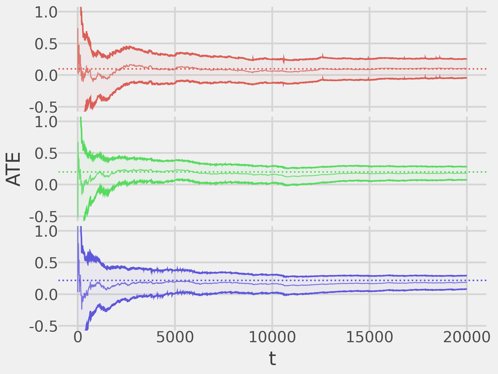
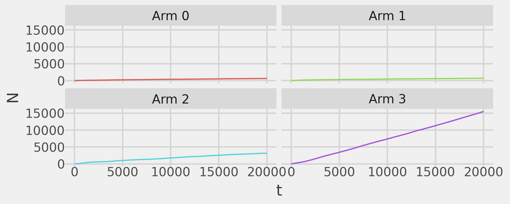
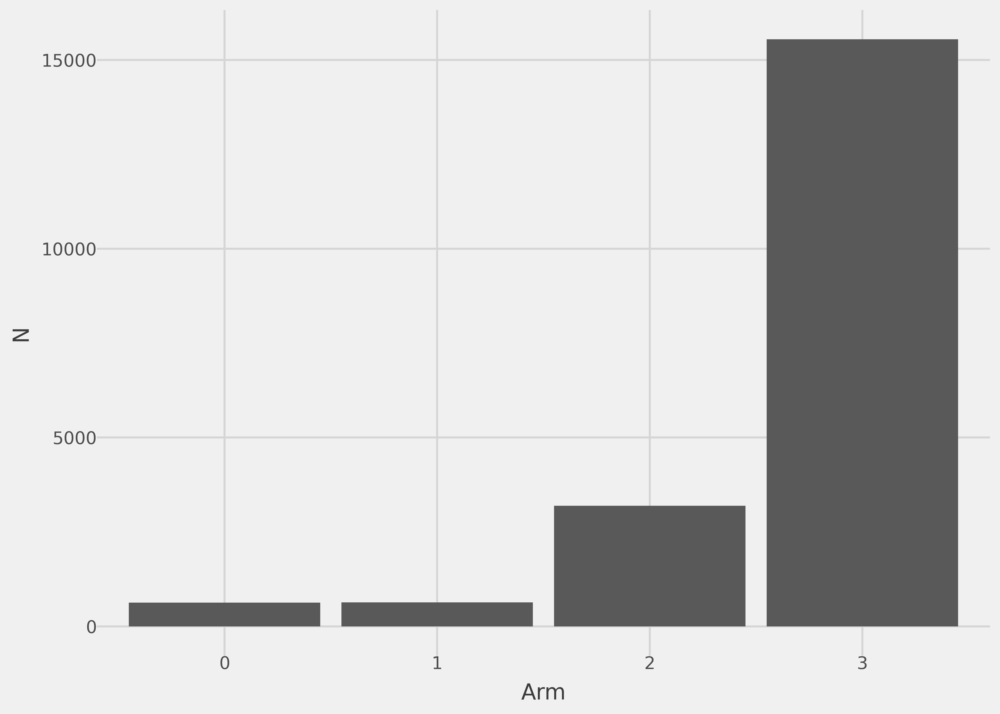
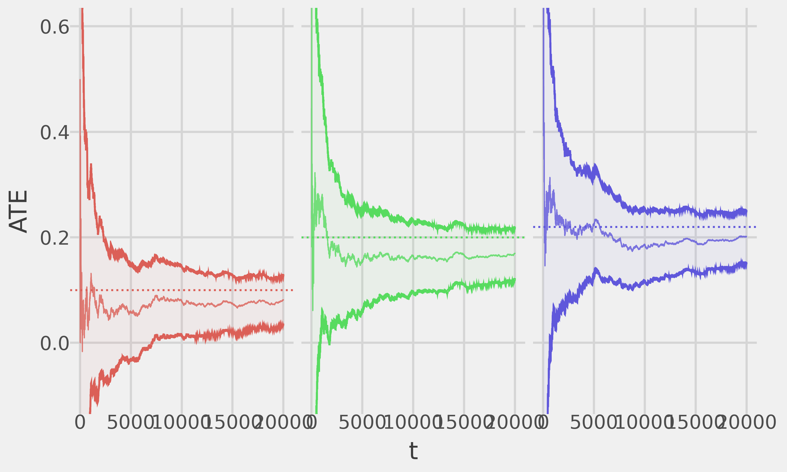
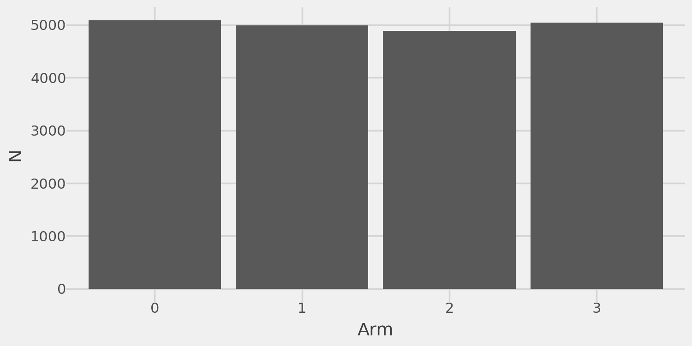

# pyssed
<a href='https://www.dmolitor.com/'></a>


<!-- This document is rendered from README.qmd; Edit that file instead! -->

<!-- badges: start -->

<!-- badges: end -->

The goal of pyssed is to implement the Mixture Adaptive Design (MAD), as
proposed by [Liang and Bojinov](https://arxiv.org/abs/2311.05794). MAD
is an experimental design for multi-armed bandit algorithms that enables
anytime-valid inference on the Average Treatment Effect (ATE).

> Intuitively, MAD “mixes” any bandit algorithm with a Bernoulli design,
> where at each time step, the probability of assigning a unit via the
> Bernoulli design is determined by a user-specified deterministic
> sequence that can converge to zero. This sequence lets managers
> directly control the trade-off between regret minimization and
> inferential precision. Under mild conditions on the rate the sequence
> converges to zero, \[MAD\] provides a confidence sequence that is
> asymptotically anytime-valid and guaranteed to shrink around the true
> ATE. Hence, when the true ATE converges to a non-zero value, the MAD
> confidence sequence is guaranteed to exclude zero in finite time.
> Therefore, the MAD enables managers to stop experiments early while
> ensuring valid inference, enhancing both the efficiency and
> reliability of adaptive experiments.

## Installation

Install pyssed from PyPI:

``` python
pip install pyssed
```

## Usage

To demonstrate the MAD, we will simulate an experiment with three
treatment arms and one control arm. We will use Thompson Sampling (TS)
as the underlying bandit algorithm and will demonstrate how MAD allows
us to unbiasedly estimate ATEs for all of our treatment arms while
providing confidence sequences with valid coverage.

Let’s begin by importing the packages we’ll need for our simulation:

``` python
import numpy as np
import pandas as pd
import plotnine as pn
from pyssed import Bandit, MAD
from typing import Callable, Dict

generator = np.random.default_rng(seed=123)
```

### Treatment arm outcomes

We’ll begin by defining a function that generates outcomes (rewards) for
each of our experiment arms:

``` python
def reward_fn(arm: int) -> float:
    values = {
        0: generator.binomial(1, 0.5),  # Control arm
        1: generator.binomial(1, 0.6),  # ATE = 0.1
        2: generator.binomial(1, 0.7),  # ATE = 0.2
        3: generator.binomial(1, 0.72), # ATE = 0.22
    }
    return values[arm]
```

Note that we are designing our experiment so that Arm 1 has a small ATE
(0.1) and Arms 2 & 3 have similar, larger ATEs (0.2 and 0.22).

### Thompson Sampling bandit

Next we will implement our underlying bandit algorithm which is TS for
binary data. Specifically, this models the outcomes from each experiment
arm as being drawn from a Bernoulli distribution with unknown parameter
$\theta$, where $\theta$ has a prior Beta($\alpha$=1, $\beta$=1)
distribution (a uniform prior).

In order to implement MAD, pyssed assumes that the bandit algorithm is a
class that follows some very specific design requirements. Specifically,
the bandit algorithm should inherit from the `pyssed.Bandit` class which
will force the bandit to implement a handful of methods that MAD relies
on. The list of required methods is as follows:

- `control()`: Returns the index of the bandit control arm.
- `k()`: Returns the number of bandit arms.
- `probabilities()`: Calculates and returns bandit arm assignment
  probabilities.
- `reward(arm)`: Calculates and returns the reward for a selected bandit
  arm.
- `t()` Returns the current time step of the bandit.

For more detailed documentation see the documentation for
`pyssed.Bandit`.

As an example we implement the TS bandit algorithm as follows:

``` python
class TSBernoulli(Bandit):
    """
    A class for implementing Thompson Sampling on Bernoulli data
    """
    def __init__(self, k: int, control: int, reward: Callable[[int], float]):
        self._active_arms = [x for x in range(k)]
        self._control = control
        self._k = k
        self._means = {x: 0. for x in range(k)}
        self._params = {x: {"alpha": 1, "beta": 1} for x in range(k)}
        self._rewards = {x: [] for x in range(k)}
        self._reward_fn = reward
        self._t = 1

    def control(self) -> int:
        return self._control
    
    def k(self) -> int:
        return self._k
    
    def probabilities(self) -> Dict[int, float]:
        assert self.k() == len(self._active_arms), "Mismatch in `len(self._active_arms)` and `self.k()`"
        samples = np.column_stack([
            np.random.beta(
                a=self._params[idx]["alpha"],
                b=self._params[idx]["beta"],
                size=1000
            )
            for idx in self._active_arms
        ])
        max_indices = np.argmax(samples, axis=1)
        probs = {
            idx: np.sum(max_indices == i) / 1000
            for i, idx in enumerate(self._active_arms)
        }
        return probs
    
    def reward(self, arm: int) -> float:
        outcome = self._reward_fn(arm)
        self._rewards[arm].append(outcome)
        if outcome == 1:
            self._params[arm]["alpha"] += 1
        else:
            self._params[arm]["beta"] += 1
        self._means[arm] = (
            self._params[arm]["alpha"]
            /(self._params[arm]["alpha"] + self._params[arm]["beta"])
        )
        return outcome

    def t(self) -> int:
        step = self._t
        self._t += 1
        return step
```

Now that we’ve implemented our TS bandit algorithm class we can wrap it
in the MAD experimental design for inference on the ATEs!

### The MAD

For our MAD design, we need to specify a function that will intake the
time-step (t) and will calculate a sequence that converges to 0. The
primary caveat is that this sequence MUST converge to 0 slower than
$1/(t^{1/4})$. Intuitively a sequence of $1/t^0 = 1$ will be equivalent
to a randomized experiment with Bernoulli randomization and, in
contrast, a sequence of $1/(t^{0.24})$ will adhere closely to the TS
assignment policy.

In this example we will use the latter sequence of $1/(t^{0.24})$.
Additionally, we will estimate 95% confidence sequences so we will set
our test size ($\alpha$) = 0.05. Finally, we will run our experiment for
a total of 20,000 (`t_star = 20000`) iterations.

``` python
experiment = MAD(
    bandit=TSBernoulli(k=4, control=0, reward=reward_fn),
    alpha=0.05,
    delta=lambda x: 1./(x**0.24),
    t_star=int(20e3)
)
experiment.fit(verbose=False)
```

### Point estimates and confidence bands

Now, to examine the results we can print a quick summary of the ATEs and
their corresponding confidence sequences when the experiment ended:

``` python
experiment.summary()
```

    Treatment effect estimates:
    - Arm 1: 0.069 (-0.08093, 0.21822)
    - Arm 2: 0.192 (0.07267, 0.31071)
    - Arm 3: 0.202 (0.09938, 0.30392)

We can also extract this summary into a pandas DataFrame:

``` python
experiment.estimates()
```

|     | arm | ate      | lb        | ub       |
|-----|-----|----------|-----------|----------|
| 0   | 1   | 0.068643 | -0.080933 | 0.218219 |
| 1   | 2   | 0.191686 | 0.072666  | 0.310707 |
| 2   | 3   | 0.201651 | 0.099383  | 0.303918 |

<p>3 rows × 4 columns</p>

### Plotting results

We can quickly visualize the ATE estimates and the corresponding
confidence sequences for each of the treatment arms over the course of
the experiment:

``` python
(
    experiment.plot_ate()
    + pn.coord_cartesian(ylim=(-.5, 1.0))
    + pn.geom_hline(
        mapping=pn.aes(yintercept="ate", color="factor(arm)"),
        data=pd.DataFrame({"arm": [1, 2, 3], "ate": [0.1, 0.2, 0.22]}),
        linetype="dotted"
    )
    + pn.theme(strip_text=pn.element_blank())
)
```



We can see that the ATE point estimates converge towards the ground
truth and that the confidence sequences provide good coverage!

We may also want to see the algorithms sample assignment strategy over
time:

``` python
experiment.plot_sample_assignment()
```



We can see that, as a result of the underlying TS algorithm, the
majority of the sample is assigned to the optimal arm Arm 3 and the
secondary Arm 2, with a small amount of random exploration in Arms 0, 1,
and 2.

Similarly, we can plot the total sample assignment to each of the
experiment arms:

``` python
experiment.plot_n()
```



### Equivalence to a completely randomized design

As noted above, if we set our time-diminishing sequence
$\delta_t = 1/t^0 = 1$, this is equivalent to a completely randomized
design. We can easily demonstrate this:

``` python
exp_bernoulli = MAD(
    bandit=TSBernoulli(k=4, control=0, reward=reward_fn),
    alpha=0.05,
    delta=lambda _: 1.,
    t_star=int(20e3)
)
exp_bernoulli.fit(verbose=False)
```

As before we can plot the convergence of the estimated ATEs to the
ground truth:

``` python
(
    exp_bernoulli.plot_ate()
    + pn.coord_cartesian(ylim=(-.1, 0.6))
    + pn.geom_hline(
        mapping=pn.aes(yintercept="ate", color="factor(arm)"),
        data=pd.DataFrame({"arm": [1, 2, 3], "ate": [0.1, 0.2, 0.22]}),
        linetype="dotted"
    )
    + pn.theme(strip_text=pn.element_blank())
)
```



And we can verify completely random assignment:

``` python
exp_bernoulli.plot_n()
```


